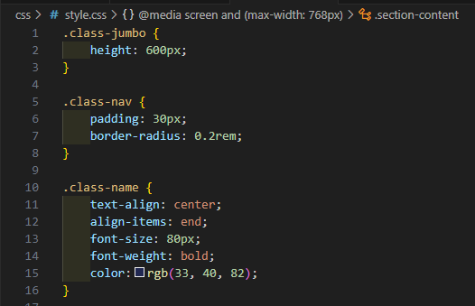
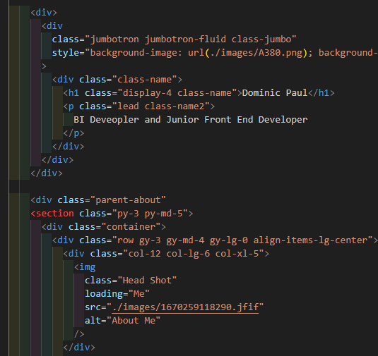

# Bootstrap-Portfolio
Portfolio v2 - using bootstrap for CSS elements
In this repo I have created a portfolio which is based on my pevious work. The fundermentals of this portfolio have been built off Bootstrap. Using bootstrap has enabled me to create a much cleaner and easy to look at portfolio without havnt to take a deep dive into the CCS. 

With the use of bootstrap I was able to use the out of the box CSS provided and simply add some extra classes myself to taylor the look and feel to my liking. See below:

Live page = https://dpaul93.github.io/Bootstrap-Portfolio/
GitHub repo = https://github.com/dpaul93/Bootstrap-Portfolio